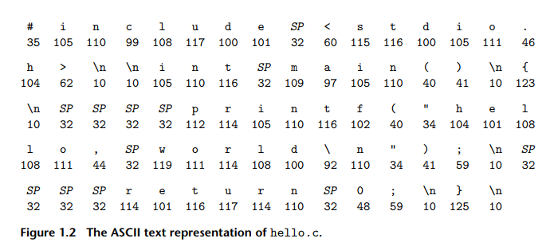

# Chapter 1: A Tour of Computer Systems

- **Computer system**:
    - **Hardware**
    - **Software**
    - They action each other to run **application programs**

## 1.1 Information Is Bits + Context

- In ```hello.c```:
    - The **informations** được biểu diễn bằng chuỗi các **bits**, chuỗi các **bytes**.
    - Mỗi **bit** là 0 or 1.
    - Cứ 1 **byte** = 8 **bit** = biểu diễn 1 **chữ cái** trong file ```hello.c``` (**program** nói chung).

    

    - Mỗi **byte** là giá trị số nguyên dương tương ứng với 1 ký tự nào đó. 
        - VD: **byte** đầu tiên có số nguyên là 35 tương ứng với ký tự ```#```.
    - **Lưu ý**: mỗi dòng văn bản được kết thúc bằng ký tự ```\n``` (***newline***) biểu diễn bằng số nguyên 10.

- Human giao tiếp với computer:
    - Code các dạng text vào file, computer sẽ dựa vào ASCII để convert text to number, that is byte, then convert byte to bits, lúc này computer sẽ hiểu các bit (chỉ chứa 0 và 1). Gọi là **text files**.
        - **Flow**: **(text) -[ascii]-> (bytes) -> (bits) -> (computer understand).**

    - Các file không phải dạng text, do đó ko dùng được ASCII, nên convert thẳng qua **bits.** Gọi là **binary files**.

- Cụm **bits** là giống nhau nhưng tùy vào **context** thì nó sẽ biễn diễn khác nhau. Cụ thể:
    - **Context 1**: Nếu dãy bits này được mở bằng phần mềm Notepad, Notepad sẽ tra cứu nó trong bảng mã ASCII. Nó thấy số 65 tương ứng với chữ cái A. Vậy là nó in chữ A lên màn hình.

    - **Context 2**: Nếu dãy bits này đang nằm trong Calculator app, chương trình sẽ không quan tâm đến bảng chữ cái. Nó chỉ nhìn vào dãy số và hiểu: "À, đây là con số 65", và nó mang số 65 đi cộng trừ nhân chia.

    - **Context 3**: Nếu dãy bits này được đưa trực tiếp vào CPU để xử lý, CPU sẽ coi đây là một câu lệnh. Đối với một số kiến trúc CPU, mã 01000001 (Hex là 41) là một lệnh có nghĩa là: "Hãy tăng giá trị của biến nhớ này lên 1 đơn vị!".

- C là ngôn ngữ được lựa chọn hàng đầu cho **system-level programming**.