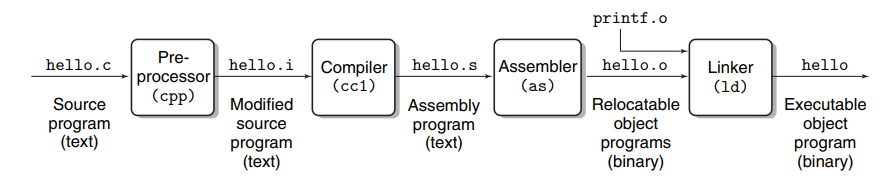
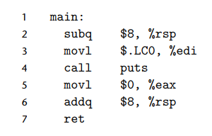

# 1.2 Programs Are Translated by Other Programs into Different Forms.

- Flow:
    

- Để từ text mà human-language sang machine-language, cần phải trải qua **compilation system** gồm *4 giai đoạn*:
    - **Preprocessing Phase**: Tìm **library**, ở đây chính là ```stdio.h``` trong ```#include<stdio.h>```, thằng ```cpp``` sẽ tìm đúng ```stdio.h``` trong system và dán thẳng full content vào your code.
        - Output: file ```hello.i```. Code này vẫn human language, nhưng khá dài vì đã gộp thêm các lib cần thiết

    - **Compilation Phase**: Thằng ```cc1``` sẽ đọc file ```hello.i``` và dịch nó sang *assembly-language*
        - Output: file ```hello.s```. Cấu trúc gần sát với machine language, human có thể hiểu nếu có deep knowlegde.
        

    - **Assembly Phase**: Thằng ```as``` sẽ nhận file ```helllo.s``` và dich bằng các lệnh assembly kia thành ***machine-language***.
        - Output: file ```hello.o```, gọi là ***relocatable object program***. File thành ***binary file*** chứa 17 bytes.

    - **Linking Phase**:
        - Đây là phiên bản chưa hoàn thiện, giống như robot thiếu cánh tay(```printf```), tương tác với user.
        - Trong **Standard C library**: cánh tay ```printf``` đã được các engineers chế tạo sẵn và cất trong lib dưới cái tên file ```printf.o```.
        - Lúc này, ông ```Linker(ld)``` sẽ đọc ```hello.o```. Lập tức chạy vào kho **Standard C Library** và tìm ```printf.o```.
        - "Nối các mạch điện từ robot sang cánh tay", đây là liên kết **memory addresses**, ngoài ra còn lắp thêm bánh xe, súng, v,v (nếu có). Sau khi lắp ráp xong xuôi, Linker đổ keo dán chặt thành 1 block thống nhất.
        - Output: ```hello```, đây là ***executable object file***, bạn chỉ cần run code, system sẽ bring this file to RAM and CPU sẽ run this one.