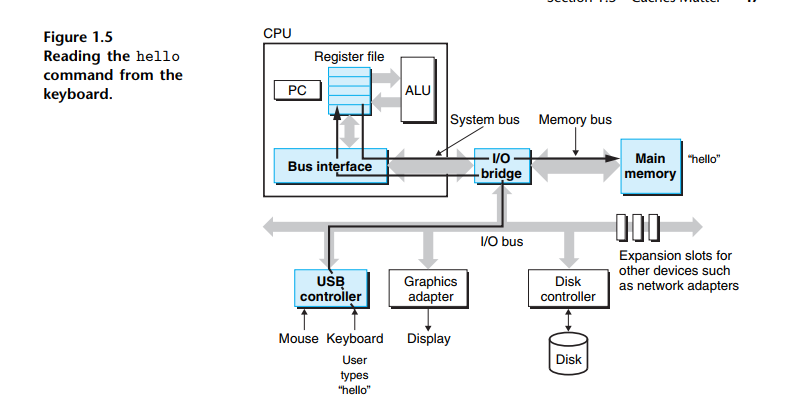
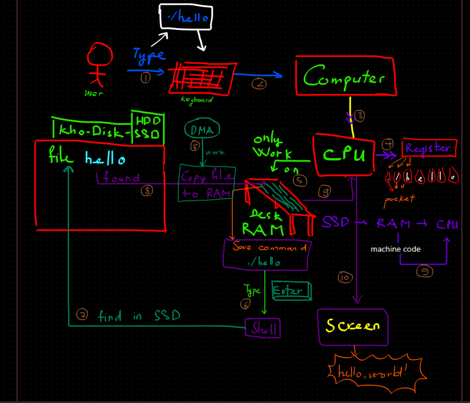

# Processors Read and Interpret Instructions Stored in Memory / Processor đọc và diễn giải instructions được lưu trong Memory


## 1.4.1 Hardware Organization of a System

- **Buses**:
    - Xuyên xuốt toàn bộ system có 1 tập hợp các đường dẫn điện (**electrical conduits**) -> ***buses***
    - Mang data qua lại giữa các thành phần của system.
    - Bus thường designed để truyền các data block có size cố định là ***words***.
    - Kích thước 1 words: ***word size***.
    - Ngày nay phần lớn computer dùng:
        - 4 bytes = 32 bits
        - 8 bytes = 64 bits

- **I/O devices**:
    - ***I/O: input/output***.
    - Cầu nối giữa computer device với thế giới bên ngoài.
    - **Ex**: keyboard + mouse (*user input*), display (*xuất data cho user*), disk drive (*lưu trữ dài hạn*).
    - Mỗi **I/O device** được kết nối với **I/O bus** thông qua:
        - controller:
            - chip nằm ngay trong device / trên motherboard.
        - or adapter:
            - card cắm vào motherboard.

- **Main Memory**:
    - Bộ nhớ tạm thời dùng để chứa:
        - program
        - data mà processor đang xử lý

    - *(Về mặt vật lý)* Main memory được tạo từ các chip **DRAM** (Dynamic Random Access Memory).

    - *(Về mặt logic)* Được xem như 1 linear array rất lớn gồm các byte. Mỗi byte chứa address riêng bắt đầu từ 0.
    - Size of data type in C phụ thuộc vào loại máy.
        - Ex: **Trên máy x86_64**:
            - short -> 2 bytes
            - int and float -> 4 bytes
            - long and double -> 8 bytes.

- **Processor (CPU)**:
    - Task:
        - đọc **instruction** từ **main memory**.
        - giải mã **instruction**.
        - thực thi **instruction**.

    - Trong CPU có 1 thiết bị lưu trữ nhỏ gọi là: ***register***
    - Một ***register*** đặc biệt gọi là ***program counter (PC)***
        - PC chứa địa chỉ của **machine-language instruction** tiếp theo sẽ được thực thi.

    - Từ lúc bật nguồn đến lúc tắt máy:
        - **processor** liên tục:

            - đọc **instruction** được PC trỏ tới
            - thực thi **instruction**
            - cập nhật PC sang **instruction** tiếp theo

- **Instruction Execution Model**:
    - Model này được định nghĩa bởi ***instruction set architecture (ISA)***.

    - Để thực thi **instruction**, CPU làm tuần tự nhiều bước:
        1. **Fetch**: CPU đọc instruction từ memory bằng địa chỉ trong PC.
        2. **Decode**: CPU giải mã các bit của instruction.
        3. **Execute**: CPU thực hiện các thao tác đơn giản được instruction yêu cầu.
        4. **Update PC**: CPU cập nhật PC tới instruction tiếp theo.

- **Các thành phần quan trọng trong CPU**:
    - **Register File**:
        - Register file là vùng lưu trữ nhỏ gồm nhiều register.
        - Mỗi register:
            - có tên riêng
            - chứa một word-sized value
        - Register cực kỳ nhanh vì nằm ngay trong CPU.

    - **ALU**:
        - ALU = Arithmetic/Logic Unit.
        - ALU thực hiện:
            - phép toán số học
            - phép toán logic
        - ALU lấy dữ liệu cũ và tạo dữ liệu mới.

- **Các thao tác cơ bản CPU thực hiện**:
    - **Load**
        - Copy:
            - byte / word từ main memory vào register.
        - Dữ liệu cũ trong register sẽ bị ghi đè.

    - **Store**:
        - Copy dữ liệu từ register vào main memory.
        - Dữ liệu cũ ở vị trí memory đó sẽ bị ghi đè.

    - **Operate**:
        - ALU lấy dữ liệu từ hai register:
            - thực hiện phép toán số học/logical
            - lưu kết quả vào register

    - **Jump**:
        - Lấy một word từ instruction và copy vào PC.
        - Điều này làm CPU nhảy sang instruction khác.

- **ISA vs Microarchitecture**:
    - **ISA** chỉ mô tả: instruction tạo ra hiệu ứng gì.
    - **microarchitecture** mô tả: CPU thực sự được implement như thế nào bên trong.

## 1.4.2 Running the ```hello``` Program

- Khi gõ ```./hello```, bên trong computer xảy ra chuyện gì?

    

    