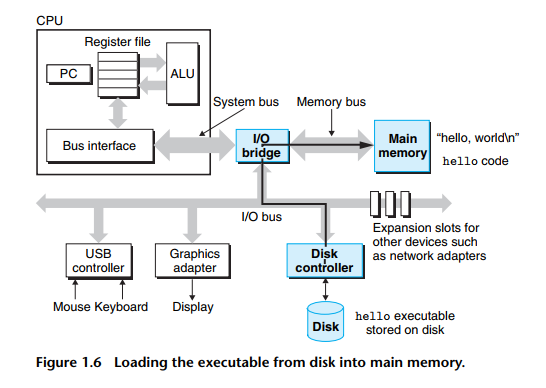
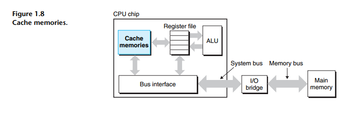
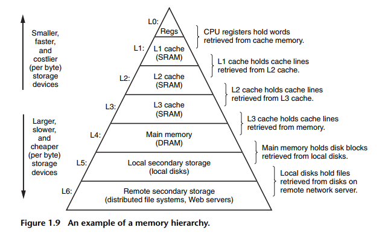

# Caches Matter

- 1 computer system cần rất nhiều time để **di chuyển data từ nơi này sang nơi khác**.
- Những lần di chuyển này là 1 dạng **overhead** (chi phí phụ thêm).

    

- Data liên tục **copy** qua lại: **Disk → RAM → CPU → GPU → Display**. Vậy memory **speed, cache, bus bandwidth** quan trọng.

- Do quy luật physical, device lưu trữ càng lớn, thường xử lý càng chậm.

- **Register** là vùng nhớ nhỏ trong CPU, CPU truy cập register gần như tức thời, dung lượng chỉ vài trăm bytes.
    - CPU đọc register nhanh gần **100 lần** so với đọc RAM.

- **Processor-Memory Gap**: khoảng cách xử lý giữa CPU và RAM. 
    - **Ex:** CPU có thể nhanh nhưng phải đợi RAM cung cấp data.
    - Lúc này, **solution** add **cache memory** (vùng nhớ nhỏ nhưng nhanh).

    

- **Cache** chứa dữ liệu mà CPU có thể sẽ dùng lại.
    - **Ex:** CPU vừa dùng biến $x$, có thể sau đó CPU lại cần $x$. Thay vì $CPU \rightarrow RAM $, chúng làm $CPU \rightarrow Cache $.

- **L1 Cache**: nằm trên CPU Chip, rất nhỏ, cực nhanh, vài chục KB, tốc độ gần bằng **register**.
- **L2 Cache**: tốc độ chậm hơn L1 1 chút.

- Cache dùng **SRAM (Static Random Access Memory)**.
- Main memory dùng **DRAM (Dynamic Random Access Memory)**.

- **Modern CPU** thường có **L1, L2, L3**.
    

- **Locality**: chương trình thường truy cập data theo vùng.
    - **Ex:** nếu vừa dùng ```array[5]``` thì rất có thể sắp dùng ```array[6]```, ```array[7]```.
    - Cache lợi dụng điều này để preload dữ liệu.

- Programmer hiểu cache có thể tăng **performance** lên cả một **order of magnitude.**