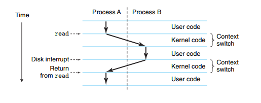

# The Operating System Manages the Hardware

- **Operating System** là người trung gian giữa **applicaion** và **hardware**.
- Nếu không có operating system, app sẽ làm việc trực tiếp trên hardware có thể xảy ra nguy hiểm như app sẽ chiếm toàn bộ hardware như CPU, RAM, lấy, chèn data, v,v. Như vậy operating system sinh ra để làm cầu nối, thông qua, giao tiếp trung gian giữa app và hardware, và chúng quản lý các hardware.
- Ví dụ như file code muốn print `hello, world!` ra màn hình, nó sẽ gọi operation system, operating system sẽ sử dụng screen in dòng chữ đó ra.
    - `hello, world!` -> operating system -> screen.

## 1.7.1 Processes

- Khi 1 file đang nằm im (chúng ta không sử dụng) như hello.exe, chorme, v,v, thì gọi là **program**.
- Sau khi cta click chúng và run, thì file đó sẽ sinh ra 1 **process**, đây coi là chương trình đang chạy trong computer. giống như "phiên bản sống" của program.

- Khi 1 program đang chạy, operating system sẽ tạo ra **illusion**.
    - ví dụ như khi mở chrome, vscode, youtube, v.v, chúng **tưởng** như **CPU, RAM, .. là của mình**. Nhưng thực tế CPU trong 1 thời điểm siêu nhỏ chạy process này, rồi chuyển qua process khác, liên tục như vậy.
    - 0.001 giây: CPU chạy Chrome
    - 0.001 giây tiếp: CPU chạy VS Code
    - 0.001 giây tiếp: CPU chạy Zalo
    - 0.001 giây tiếp: CPU chạy lại Chrome
    - User cảm giác như các program đang chạy đồng thời -> **concurrent execution**.

- **Concurrent = nhiều process cùng làm việc, nhưng thay phiên nhau**
    - Ví dụ như đầu bếp xào rau, chiên trứng, xào thịt. 1 người làm nhiều việc bằng cách chuyển qua lại giữa các task.

- **Parallel = nhiều process chạy cùng lúc**.
    - 3 đầu bếp cùng nấu món ăn.

- **Context = toàn bộ trạng thái cần thiết để một process có thể tiếp tục chạy đúng chỗ nó đã dừng.**
    - Ví dụ bạn đang đọc sách đến trang 53, dòng thứ 10. Sau đó bạn đi ăn cơm. Muốn quay lại đọc tiếp, bạn cần nhớ:
        - Mình đang đọc sách nào?
        - Đang ở trang mấy?
        - Đang đọc dòng nào?
        - Đang hiểu đến đoạn nào?
    - Đó là **context**.

- **PC = Program Counter** (thanh ghi cho biết CPU đang chạy đến dòng lệnh nào tiếp theo.)

- **Register file** = các thanh ghi CPU đang chứa dữ liệu tạm thời.

- **Context switch** = OS tạm dừng process hiện tại, lưu trạng thái của nó, rồi khôi phục trạng thái của process khác để chạy tiếp.
    

- **Kernel là phần lõi của Operating System, luôn nằm trong memory, chuyên quản lý hardware và process.**